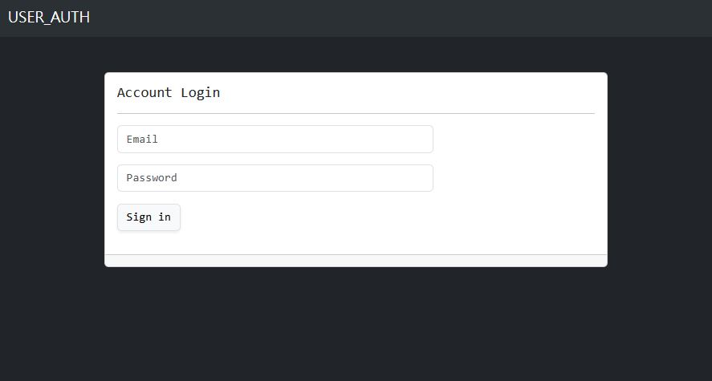

## 這是一份在Express框架製作登入機制的練習

## 示意圖



## 測試帳號密碼如下

```javascript
const users = [
  {
    firstName: 'Tony',
    email: 'tony@stark.com',
    password: 'iamironman'
  },
  {
    firstName: 'Steve',
    email: 'captain@hotmail.com',
    password: 'icandothisallday'
  },
  {
    firstName: 'Peter',
    email: 'peter@parker.com',
    password: 'enajyram'
  },
  {
    firstName: 'Natasha',
    email: 'natasha@gamil.com',
    password: '*parol#@$!'
  },
  {
    firstName: 'Nick',
    email: 'nick@shield.com',
    password: 'password'
  }
]
```
